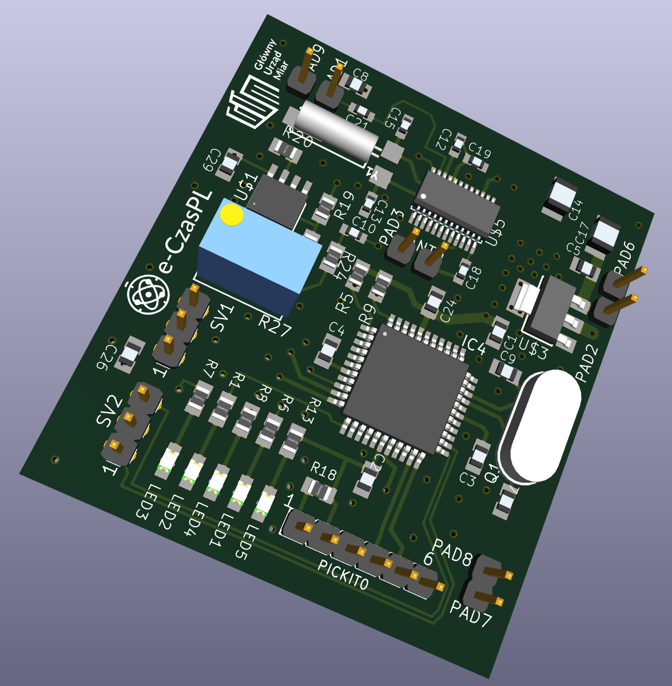

# TimeReceiver225kHz

A simple receiver module for decoding a time frame from a 225kHz transmitter PCSK-225 in Solec Kujawski, Poland

<h2>What's e-Czas</h2>

Providing the service of reliable and reliable distribution of official time signals valid in the territory of the Republic of Poland and signals of the Polish implementation of the international coordinated universal time UTC (PL), generated
based on the state standard for time measurement units and frequency, with the status (guarantee) of official time and synchronization monitoring service.

<h2>What's e-Czas Radio?</h2>

The e-Czas Radio service is used to distribute coded official time signals in the territory of the Republic of Poland using long radio waves. End-user synchronization accuracy: <0.01 s

As part of the e-CzasPL project, a service was launched for emitting coded digital time signals on long waves, using the 225 kHz carrier wave of the First Polish Radio Program, from a transmitter located in Poland (a technique similar to the DCF77 (Germany), WWVB (USA), JJY (Japan) system, but based on signal phase modulation), which creates a generally available option to synchronize any time-measuring device with the official time in the Republic of Poland using cheap, energy-saving and simple receiving devices. This technique allows many time-measuring devices to be synchronized to the official time in the Republic of Poland with an accuracy of several or a dozen milliseconds. The system is an additional (redundant) source of time information for users located in Poland.

The standard signals are generated based on a stable frequency module based on highly stable rubidium frequency standards in the Radio Broadcasting Center (RCN) in Solec Kujawski. Using receiving devices located at the headquarters of the Central Office of Measures in Warsaw, employees of the Time and Frequency Laboratory remotely monitor changes in the frequency of the carrier wave, as well as monitor the accuracy of encoded time signals and compare them with the Official Time Scale in force in the Republic of Poland generated and maintained in the Central Office of Measures.

The technique using digitally coded time signals involves emitted radio waves from RCN Solec Kujawski and the use of dedicated receivers by end users. You can download documentation related to the technical parameters of the transmitted time signal and a description of the process of making a simplified receiver of coded official time signals on the 225 kHz carrier wave of the First Polish Radio Program.
  
<ul>
<li>In the "/doc" folder you will find documentation (in Polish) describing how to encode and receive a time frame. 
<li>In the "/Eagle" folder you can find design of the receiver in Autodesk Eagle format. 
<li>In the "/KiCAD" folder you can find design of the receiver in in KiCAD format (comming soon). 
</ul>

<i>We are working on translating these PDF documents into English.</i>