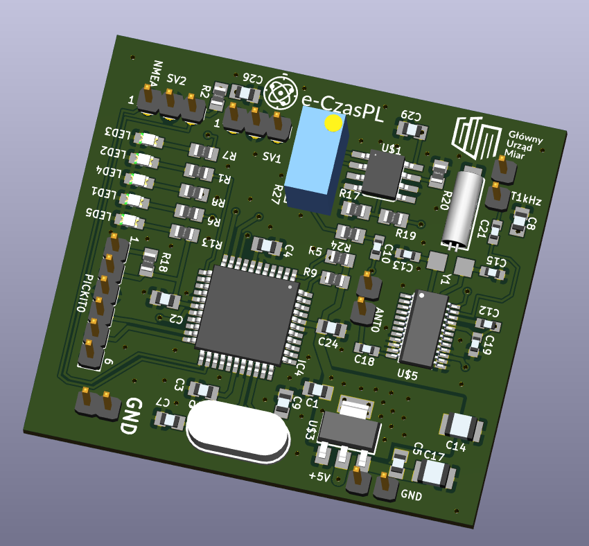
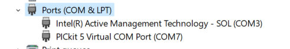
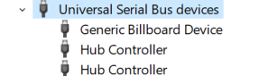
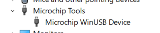
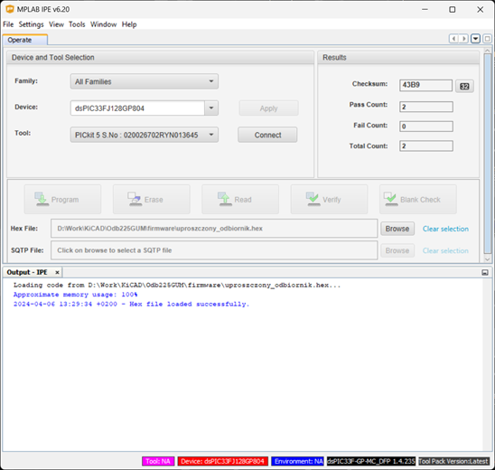
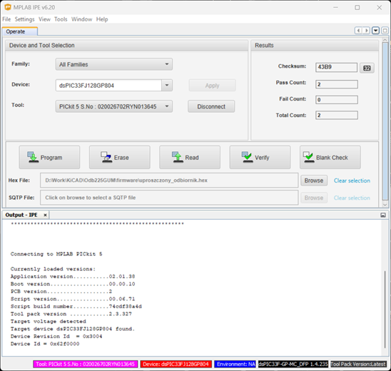
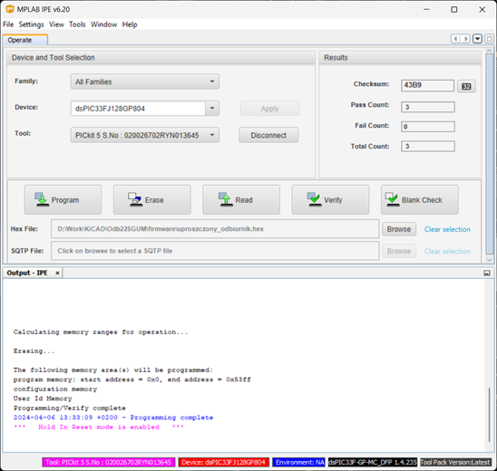

# TimeReceiver225kHz
<html>
<body>
<H1>A simple receiver module for decoding a time frame from a 225kHz transmitter PCSK-225 in Solec Kujawski, Poland</h1>

<H2>Content</H2>
<h3>English</h3>
<ul>
  <li><a href="#en1">Changes</li>
  <li><a href="#en1">What's e-Czas</a></li>
  <li><a href="#en2">What's e-Czas Radio?</a></li>
  <li><a href="#en1">Flash programming guide</a></li>
</ul>
<h3>Polski</h3>
<ul>
<li><a href="#pl0">Zmiany</a></li>
<li><a href="#pl1">Co to jest e-Czas?</a></li>
<li><a href="#pl2">Co to jest e-Czas Radio?</a></li>  
<li><a href="#pl3">Instrukcja programowania procesora</a></li>
</ul>
<h2 id="en0">Changes</h2>
<ul>
  <li><b>2024-06-11:</b> Thanks to Damian Jabłoński, who found an error in the scheme. This caused the processor to operate unstablely. Resistor R2 20k (shown in the current schematic) should be added to fix the error.</li>
   <li><b>2024-06-12:</b> 
   The repository contains corrected versions of the project files in KiCAD. In the KiCAD/1.0/bom folder, you can find the interactive BOM in HTML. In the KiCAD/1.0/production folder, you can find production (Gerber) files for fixed PCB.
   </li>
      <li><b>2024-06-14:</b> The repository contains corrected versions firmware. It doesn't need the resistor R2 (20k). Currently is used internal pull-up resistor.
   </li>

</ul>
 
    
<h2 id="en1">What's e-Czas</h2>

Providing the service of reliable and reliable distribution of official time signals valid in the territory of the Republic of Poland and signals of the Polish implementation of the international coordinated universal time UTC (PL), based on the state standard for time measurement units and frequency, with the status (guarantee) of official time and synchronization monitoring service.

<h2 id="en2">What's e-Czas Radio?</h2>

The e-Czas Radio service is used to distribute coded official time signals in the territory of the Republic of Poland using long radio waves. End-user synchronization accuracy: &lt;0.01 s

As part of the e-CzasPL project, a service was launched for emitting coded digital time signals on long waves, using the 225 kHz carrier wave of the First Polish Radio Program, from a transmitter located in Poland (a technique similar to the DCF77 (Germany), WWVB (USA), JJY (Japan) system, but based on signal phase modulation), which creates a generally available option to synchronize any time-measuring device with the official time in the Republic of Poland using cheap, energy-saving and simple receiving devices. This technique allows many time-measuring devices to be synchronized to the official time in the Republic of Poland with an accuracy of several or a dozen milliseconds. The system is an additional (redundant) source of time information for users located in Poland.

The standard signals are generated using a stable frequency module based on highly stable rubidium frequency standards in the Radio Broadcasting Center (RCN) in Solec Kujawski. Using receiving devices located at the headquarters of the Central Office of Measures in Warsaw, employees of the Time and Frequency Laboratory remotely monitor changes in the frequency of the carrier wave, as well as monitor the accuracy of encoded time signals and compare them with the Official Time Scale in force in the Republic of Poland generated and maintained in the Central Office of Measures.

The technique using digitally coded time signals involves emitted radio waves from RCN Solec Kujawski and the use of dedicated receivers by end users. You can download documentation related to the technical parameters of the transmitted time signal and a description of the process of making a simplified receiver of coded official time signals on the 225 kHz carrier wave of the First Polish Radio Program.
  
<ul>
<li>In the "/doc" folder, you will find documentation (in Polish) describing how to encode and receive a time frame. 
<li>In the "/Eagle" folder, you can find the design of the receiver in Autodesk Eagle format. 
<li>In the "/KiCAD" folder, you can find the design of the receiver in KiCAD format. 
<li>In the "/Firmware" folder, you can find firmware for the DSPIC33FJ128GP804 processor in HEX format. 

</ul>

<h3>Power</h3>

The best solution is to use a 5V power supply, e.g. USB. Current consumption is approximately 100mA @ 5V.

<h2 id="en3">Flash programming guide</h2>

I use <a href="https://www.microchip.com/en-us/development-tool/PG164150" target=_blank>PICKIT5, which is not much more expensive than the previous ones and can program without a computer, in the "field." The instructions below describe installing the required software in a Windows 11 environment.
<ol>p
<li>Install <a href="https://www.microchip.com/en-us/tools-resources/develop/mplab-x-ide" target=_blank>MPLAB X IDE</a>
<li>When you install MPLAB and connect PICKIT5 to USB, sometimes the system doesn't recognize it properly. Then open "Device Manager" and check the "Ports (COM & LPT) section. It should look like this:  
In the "Universal Serial Bus devices"  If no drivers are installed, this will show >
 In the "Microchip Tools" 
 If the last section does not exist, you must update the drivers on your device, which will appear in the "Universal Serial Bus devices" section.
<li>Without the correct driver, the system will show the error "Failed to get Device ID. Please ensure the target device is attached and try the operation again."
<li>Check the 3V3 power supply at the output of the LM1117 stabilizer
<li>Connect the PICKIT5 programmer to the connector on the board. (pins 1 to 5)
<li>Run MPLAB IPE - specify the path to the HEX file, processor type 
<li>Click "Connect", the board must be powered 
<li>Program CPU 
<li>Turn off the power, disconnect the programmer
</ol>

<h1>Prosty moduł odbiorczy do dekodowania ramek czasu z nadajnika PCSK-225 225kHz w Solcu Kujawskim</h1>

<h2 id="pl0">Zmiany</h2>
<ul>
  <li><b>2024-06-11:</b> Dziękuję Damianowi Jabłońskiemu, który znalazł błąd w schemacie i opracował poprawkę. Błąd skutkował niestabilną pracą procesora. Rozwiązaniem jest dolutowanie rezystora R2 między pinem 3 złącza SV2 a VDD rezystora 20k (R2). Poprawka naniesiona jest na aktualną wersję projektu w KiCAD</li>
   <li><b>2024-06-12:</b> Repozytorium zawiera poprawione pliki projektu. W folderze KiCAD/1.0/bom znajdziesz interaktywny BOM w HTML ułatwiający montaż, w foderze KiCAD/1.0/production są aktualne pliki produkcyjne (Gerber) poprawionego PCB - można je np. wysłać do produkcji (bez rozpakowania).
   </li>
      <li><b>2024-06-14:</b> Repozytorium zawiera poprawiony plik HEX z firmware.  Nie jest konieczne umieszczanie rezystora R2(20k). Obecnie używany jest wewnętrzny rezystor pull-up.
   </li>

</ul>

<h2 id="pl1">Co to jest e-Czas</h2>
Jest tu usługa dystrybucji wiarygodnej i niezawodnej sygnałów czasu urzędowego, obowiązującego na obszarze Rzeczypospolitej Polskiej i sygnałów polskiej realizacji międzynarodowego uniwersalnego czasu koordynowanego UTC(PL), generowanych w oparciu o państwowy wzorzec jednostek miar czasu i częstotliwości, posiadającego status (gwarancję) czasu urzędowego oraz usługi monitorowania synchronizacji.

<h2 id="pl2">Co to jest e-Czas Radio</h2>

Główny Urząd Miar (GUM) uruchomił serwis emitowania kodowanych cyfrowych sygnałów czasu na falach długich, przy wykorzystaniu fali nośnej 225 kHz Programu Pierwszego Polskiego Radia, z nadajnika znajdującego się na terytorium Polski. Jest to technika podobna do systemu DCF77, ale oparta na modulacji fazy sygnału. 
W efekcie powstała ogólnodostępna możliwość zsynchronizowania z czasem urzędowym dowolnego urządzenia odmierzającego czas na obszarze Polski i dużej części Europy przy wykorzystaniu tanich, energooszczędnych i nieskomplikowanych urządzeń odbiorczych. Wykorzystanie tej techniki pozwala na zsynchronizowanie do czasu urzędowego na obszarze RP wielu urządzeń odmierzających czas z dokładnością kilku lub kilkunastu milisekund. System będzie dodatkowym (redundantnym) źródłem informacji o czasie dla użytkowników znajdujących się na terytorium Polski.

Usługa Radia e-Czas służy do dystrybucji kodowanych oficjalnych sygnałów czasu na terytorium Rzeczypospolitej Polskiej za pomocą fal długich radiowych. Dokładność synchronizacji z użytkownikiem końcowym: <0,01 s

W ramach projektu e-CzasPL uruchomiono usługę emisji kodowanych cyfrowych sygnałów czasu na falach długich, wykorzystując falę nośną 225 kHz Pierwszego Programu Polskiego Radia, z nadajnika znajdującego się w Polsce (technika zbliżona do systemu DCF77 (Niemcy), WWVB (USA), JJY (Japonia), ale oparta na modulacji fazy sygnału),  co stwarza ogólnodostępną możliwość synchronizacji dowolnego urządzenia mierzącego czas z czasem urzędowym w Rzeczypospolitej Polskiej za pomocą tanich, energooszczędnych i prostych urządzeń odbiorczych. Technika ta pozwala na synchronizację wielu urządzeń do pomiaru czasu z czasem urzędowym w Rzeczypospolitej Polskiej z dokładnością do kilku lub kilkunastu milisekund. System jest dodatkowym (redundantnym) źródłem informacji o czasie dla użytkowników znajdujących się na terenie Polski.

Sygnały standardowe generowane są w oparciu o moduł częstotliwości stabilnej oparty na wysoce stabilnych wzorcach częstotliwości rubidowych w Radiostacji Nadawczej (RCN) w Solcu Kujawskim. Pracownicy Laboratorium Czasu i Częstotliwości zdalnie monitorują zmiany częstotliwości częstotliwości fali nośnej, a także monitorują dokładność kodowanych sygnałów czasowych i porównują je z obowiązującą w Rzeczypospolitej Polskiej Oficjalną Skalą Czasu generowaną i utrzymywaną w Głównym Urzędzie Miar.

Technika wykorzystująca cyfrowo kodowane sygnały czasu polega na emisji fal radiowych z RCN Solec Kujawski oraz wykorzystaniu dedykowanych odbiorników przez użytkowników końcowych. Można pobrać dokumentację związaną z parametrami technicznymi nadawanego sygnału czasu oraz opis procesu wykonania uproszczonego odbiornika kodowanych oficjalnych sygnałów czasu na fali nośnej 225kHz Pierwszego Programu Polskiego Radia (PCSK-225).
  
<ul>
<li>W folderze "/doc" znajdziesz dokumentację opisującą sposób kodowania i odbierania ram czasowych. 
<li>W folderze "/Eagle" znajduje się projekt odbiornika w formacie Autodesk Eagle. 
<li>W folderze "/KiCAD" znajduje się projekt odbiornika w formacie KiCAD. 
<li>W folderze "/Firmware" można znaleźć oprogramowanie układowe dla DSPIC33FJ128GP804 procesora w formacie HEX. 

</ul>
<h3>Zasilanie</h3>

Najlepszym rozwiązaniem jest użycie zasilania 5V np. USB. Pobór prądu wynosi ok 100mA przy 5V.

<h2 id="pl3">Instrukcja programowania procesora</h2>

Ja używam <a href="https://www.microchip.com/en-us/development-tool/PG164150" target=_blank>PICKIT5, niewiele droższy od poprzednich a mający dodatkowo możliwość programowania bez komputera, w "polu". Poniżej opisuje instalację wymaganego oprogramowania w środowisku Windows 11.
<ol>
<li>Zainstaluj <a href="https://www.microchip.com/en-us/tools-resources/develop/mplab-x-ide" target=_blank>MPLAB X IDE</a>
<li>Po zainstalowaniu MPLAB i podłaczeniu PICKIT5 do USB czasami system nie rozpoznaje go prawidłowo. Wtedy otwórz "Device Manager" i sprawdź sekcję "Ports (COM & LPT). Powinna wyglądać tak:  
W sekcji "Universal Serial Bus devices"  Jeżeli nie są zainstalowane sterowniki, pokaże się to >
 W sekcji "Microchip Tools" 
 Jeżeli ostatnia sekcja nie istnieje należy zaktualizować sterowniki w urządzeniu które pojawi się w sekcji "Universal Serial Bus devices".
<li>Bez prawidłowego sterownika, system pokaże błąd "Failed to get Device ID. Please make sure the target device is attached and try the operation again."
<li> sprawdzić zasilanie 3V3 na wyjściu stabilizatora LM1117
<li>Podłączyć programator PICKIT5 do złącza na płytce. (piny od 1 do 5)
<li>Uruchomić program MPLAB IPE - podać ścieżgę do pliku HEX, typ procesora 
<li>Kliknąć "Connect", płytka musi być zasilana 
<li>Zaprogramować procesor 
<li>Wyłączyć zasilanie, odłączyć programator
</ol>

<h2>Projekty połączone</h2>
<ol>
<li><a href="https://github.com/J-K-Kowalski/PCSK225-Antenna" target="_blank">Antena aktywna na tranzystorze FET</a></li>
<li><a href="https://github.com/J-K-Kowalski/PCSK225_RECV_USB" target="_blank">Odbiornik z interfejsem USB</a></li>
<li><a href="https://github.com/sp5wwp/e-Czas" target="_blank">SP5WWP - Dekoder e-Czas</a></li>
<li><a href="https://github.com/sp6hfe/e-CzasPL" target="_blank">e-CzasPL Radio reference C++ data decoder by SP6HFE</a></li>
</ol>

Jurek K. Kowalski

<table border=0 cellpadding=0 cellspacing=0 width="100%"><tr>
<td align=left>

</td>
<td align=right>
</td>
</tr>
</table>
</body>
</html>
